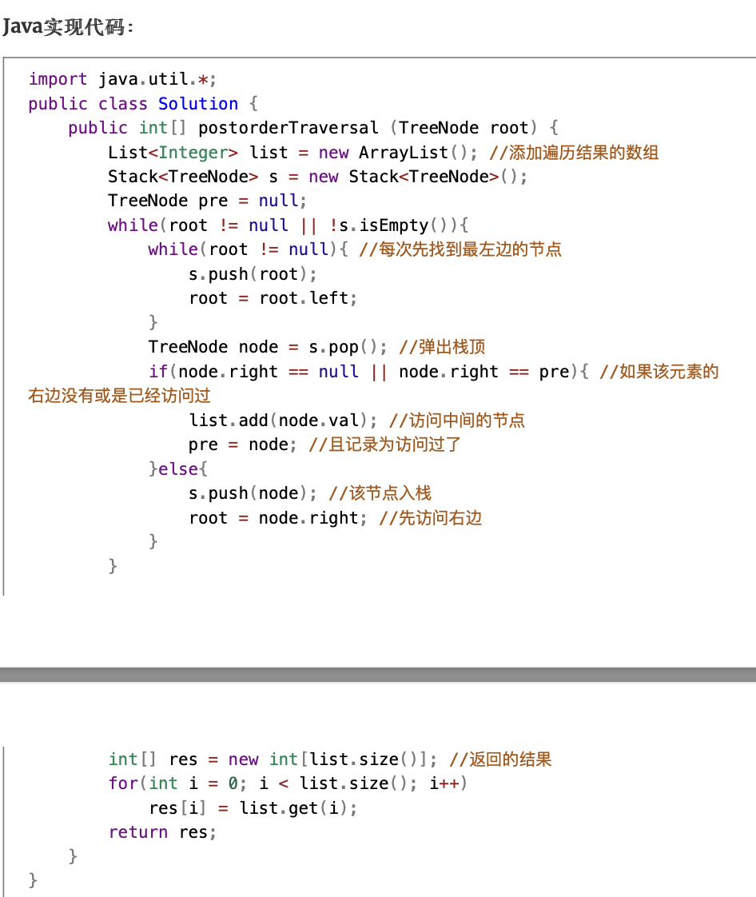

#### Offer3[数组中重复的数字](https://leetcode-cn.com/problems/shu-zu-zhong-zhong-fu-de-shu-zi-lcof/)简单

```java
//哈希表
class Solution {
    public int findRepeatNumber(int[] nums) {
        Set<Integer> set = new HashSet<>();
        for(int n: nums){
            if(!set.add(n)){
                return n;
            }
        }
        return 0;
    }
}
```

```java
//原地交换
class Solution {
    public int findRepeatNumber(int[] nums) {
        int i = 0;
        while(i < nums.length) {
            if(nums[i] == i) {
                i++;
                continue;
            }
            if(nums[nums[i]] == nums[i]) return nums[i];
            int tmp = nums[i];
            nums[i] = nums[tmp];
            nums[tmp] = tmp;
        }
        return -1;
    }
}
```


#### Offer6[从尾到头打印链表](https://leetcode-cn.com/problems/cong-wei-dao-tou-da-yin-lian-biao-lcof/)简单

```java
// 反转链表
public int[] reversePrint(ListNode head) {
        if(head == null) return new int[0];
        ListNode pre = null;
        ListNode next = null;
        int n = 0;
        while(head != null){
            next= head.next;
            head.next = pre;
            pre = head;
            head = next;
            n++;
        }
        
        int[] ans = new int[n];
        for(int i=0; i<n; ++i){
            ans[i] = pre.val;
            pre = pre.next;
        }
        return ans;
    }
```

```java
//栈
/**
 * Definition for singly-linked list.
 * public class ListNode {
 *     int val;
 *     ListNode next;
 *     ListNode(int x) { val = x; }
 * }
 */
class Solution {
    public int[] reversePrint(ListNode head) {
        Stack<ListNode> stack = new Stack<ListNode>();
        ListNode temp = head;
        while (temp != null) {
            stack.push(temp);
            temp = temp.next;
        }
        int size = stack.size();
        int[] print = new int[size];
        for (int i = 0; i < size; i++) {
            print[i] = stack.pop().val;
        }
        return print;
    }
}
```

```java
//递归
/**
 * Definition for singly-linked list.
 * public class ListNode {
 *     int val;
 *     ListNode next;
 *     ListNode(int x) { val = x; }
 * }
 */
class Solution {
    List<Integer> tmp = new ArrayList<>();
    public int[] reversePrint(ListNode head) {
        dfs(head);
        int[] ans = new int[tmp.size()];
        for(int i=0; i<ans.length; ++i){
            ans[i] = tmp.get(i);
        }
        return  ans;
    }

    private void dfs(ListNode head) {
        if(head == null) return;
        dfs(head.next);
        tmp.add(head.val);
    }
}
```


#### Offer7[重建二叉树](https://leetcode-cn.com/problems/zhong-jian-er-cha-shu-lcof/)中等

```java
/**
 * Definition for a binary tree node.
 * public class TreeNode {
 *     int val;
 *     TreeNode left;
 *     TreeNode right;
 *     TreeNode(int x) { val = x; }
 * }
 */
class Solution {
    public Map<Integer, Integer> map = new HashMap<>();
    public TreeNode buildTree(int[] preorder, int[] inorder) {
        for(int i=0; i<inorder.length; ++i){
            map.put(inorder[i], i);
        }
        int right = inorder.length-1;
        return recur(preorder, 0, 0, right);
    }
// root为preorder中根节点的索引，left和right分别为inorder中左右边界
    private TreeNode recur(int[] preorder, int root, int left, int right) {
        if(left > right) return null;
        TreeNode node = new TreeNode(preorder[root]);
        int i = map.get(preorder[root]);
        node.left = recur(preorder, root+1, left, i-1);
        node.right = recur(preorder, root+i-left+1, i+1, right);
        return node;
    }
}
```


#### Offer11[旋转数组的最小数字](https://leetcode-cn.com/problems/xuan-zhuan-shu-zu-de-zui-xiao-shu-zi-lcof/)简单

```java
// 二分查找
public int minArray(int[] numbers) {
        int i = 0, j = numbers.length - 1;
        while (i < j) {
            int m = (i + j) / 2;
            if (numbers[m] > numbers[j]) i = m + 1;
            else if (numbers[m] < numbers[j]) j = m;
            else j--;
        }
        return numbers[i];
    }
```


#### offer12[矩阵中的路径](https://leetcode-cn.com/problems/ju-zhen-zhong-de-lu-jing-lcof/)中等

```java
// 回溯
class Solution {
    int t[][] = {{0, -1},{0, 1},{1, 0},{-1, 0}};
    public boolean exist(char[][] board, String word) {
        int n = board.length;
        int m = board[0].length;
        char[] s = word.toCharArray();
        for(int i=0; i<n; ++i){
            for(int j=0; j<m; ++j){
                if(dfs(board, s, i, j, 0)) return true;
            }
        }
        return false;
    }

    private boolean dfs(char[][] board, char[] s, int i, int j, int k) {
        if(i> board.length -1 || i<0 || j> board[0].length -1 || j<0 || board[i][j] != s[k]) return false;
        if(k == s.length -1) return true;
        board[i][j] = '\0';
        boolean res = dfs(board, s, i+1, j, k+1) || dfs(board, s, i, j+1, k+1) 
                   || dfs(board, s, i-1, j, k+1) || dfs(board, s, i, j-1, k+1);
        board[i][j] = s[k];
        return res;
    }
}
```


```
先初始化dp[m][n]数组，河流为1，其他为0.
起点坐标（si，sj），终点坐标（ei，ej）


int min=m*n+1（初始化为大的值）
int t[][] = {{0, -1},{0, 1},{1, 0},{-1, 0}};
dfs(si,sj)

dfs(dp, i, j){
	if(i)
}
```


#### offer15[二进制中1的个数](https://leetcode-cn.com/problems/er-jin-zhi-zhong-1de-ge-shu-lcof/)简单

```java
//按位与
public int hammingWeight(int n) {
        int res = 0;
        for(int i=0; i< 32; ++i){
            if((n & (1 << i)) !=0 ) {
                res++;
            }
        }
        return res;
    }
```

```java
//n & (n−1)，其预算结果恰为把 nn 的二进制位中的最低位的 11 变为 00 之后的结果
public int hammingWeight(int n) {
        int ret = 0;
        while (n != 0) {
            n &= n - 1;
            ret++;
        }
        return ret;
    }
```


#### offer16[数值的整数次方](https://leetcode-cn.com/problems/shu-zhi-de-zheng-shu-ci-fang-lcof/)中等

```java
//快速幂
public double myPow(double x, int n) {
        if(x == 0) return 0;
        long b = n;
        double res = 1.0;
        if(b < 0) {
            x = 1 / x;
            b = -b;
        }
        while(b > 0) {
            if((b & 1) == 1) res *= x;
            x *= x;
            b >>= 1;
        }
        return res;
    }
```


#### offer17[打印从1到最大的n位数](https://leetcode-cn.com/problems/da-yin-cong-1dao-zui-da-de-nwei-shu-lcof/)简单

```java
//大数, 回溯
class Solution {
    int[] res;
    int nine = 0, count = 0, start, n;
    char[] num, loop = {'0', '1', '2', '3', '4', '5', '6', '7', '8', '9'};
    public int[] printNumbers(int n) {
        this.n = n;
        res = new int[(int)Math.pow(10, n) - 1];
        num = new char[n];
        start = n - 1;
        dfs(0);
        return res;
    }

    private void dfs(int i) {
        if(i == n){
            String s = String.valueOf(num).substring(start);
            if(!s.equals("0")) res[count++] = Integer.parseInt(s);
            if(n - start == nine) start--;
            return;
        }
        for(char c: loop){
            if(c == '9') nine++;
            num[i] = c;
            dfs(i+1);
        }
        nine--;
    }
}
```


#### offer19

```java
//动态规划
class Solution {
    public boolean isMatch(String s, String p) {
        int m = s.length();
        int n = p.length();

        boolean[][] f = new boolean[m + 1][n + 1];
        f[0][0] = true;
        for (int i = 0; i <= m; ++i) {
            for (int j = 1; j <= n; ++j) {
                if (p.charAt(j - 1) == '*') {
                    f[i][j] = f[i][j - 2];
                    if (matches(s, p, i, j - 1)) {
                        f[i][j] = f[i][j] || f[i - 1][j];
                    }
                } else {
                    if (matches(s, p, i, j)) {
                        f[i][j] = f[i - 1][j - 1];
                    }
                }
            }
        }
        return f[m][n];
    }

    public boolean matches(String s, String p, int i, int j) {
        if (i == 0) {
            return false;
        }
        if (p.charAt(j - 1) == '.') {
            return true;
        }
        return s.charAt(i - 1) == p.charAt(j - 1);
    }
}
```


#### offer26[树的子结构](https://leetcode-cn.com/problems/shu-de-zi-jie-gou-lcof/)中等

```java
public boolean isSubStructure(TreeNode A, TreeNode B) {
        return (A != null && B != null) && (dfs(A, B) || isSubStructure(A.left, B) || isSubStructure(A.right, B));
    }

    private boolean dfs(TreeNode a, TreeNode b) {
        if(b == null) return true;
        if(a == null) return false;
        if(a.val != b.val) return false;
        return dfs(a.right, b.right) && dfs(a.left, b.left);
    }
```


#### Offer30[包含min函数的栈](https://leetcode-cn.com/problems/bao-han-minhan-shu-de-zhan-lcof/)简单

```java
class MinStack {
    Stack<Integer> A;
    Stack<Integer> B;
    /** initialize your data structure here. */
    public MinStack() {
        A = new Stack<>();
        B = new Stack<>(); // 用于存放最小值的栈，占顶是最小值
    }

    public void push(int x) {
        A.push(x);
        if(B.isEmpty() || x <= B.peek()){
            B.push(x);
        }
    }

    public void pop() {
        if(A.pop().equals(B.peek())){ // Integer不能写成==判断
            B.pop();
        }
    }

    public int top() {
        return A.peek();
    }

    public int min() {
        return B.peek();
    }
}
```


#### Offer31[栈的压入、弹出序列](https://leetcode-cn.com/problems/zhan-de-ya-ru-dan-chu-xu-lie-lcof/)中等

```java
public boolean validateStackSequences(int[] pushed, int[] popped) {
        int n = pushed.length;
        int m = popped.length;
        if(n != m) return false;
        if(n==0 && m==0) return true;
        int j=0;
        int index=-1;
        for(int i=0; i<n; i++){
            index++;
            pushed[index] = pushed[i]; //这一行特别重要，如果pushed中有出栈的元素，将还在栈中的元素更新index。
            while(index>=0 && pushed[index] == popped[j]){
                j++;
                index--;
            }
        }
        return j==m;
    }
```


#### offer33[二叉搜索树的后序遍历序列](https://leetcode-cn.com/problems/er-cha-sou-suo-shu-de-hou-xu-bian-li-xu-lie-lcof/)中等

```java
//递归分治
public boolean verifyPostorder(int[] postorder) {
        int n = postorder.length;
        if(n == 0 || n == 1) return true;
        return dfs(postorder, 0, n-1);
    }

    private boolean dfs(int[] postorder, int l, int r) {
        if(l>=r) return true;
        int p = l;
        while(postorder[p] < postorder[r]) p++;
        int m = p;
        while(postorder[p] > postorder[r]) p++;
        return p == r && dfs(postorder, l, m-1) && dfs(postorder, m, r);
    }
```

```java
//其逆序为根，右，左；借助栈来操作，先把根所有的右节点入栈（这些节点均大于根节点）
class Solution {
    public boolean verifyPostorder(int[] postorder) {
        Stack<Integer> stack = new Stack<>();
        int root = Integer.MAX_VALUE;
        for (int i = postorder.length-1; i >= 0 ; i--) {
            if (postorder[i] >= root) return false;
            while (!stack.isEmpty() && stack.peek() > postorder[i])
                root = stack.pop();
            stack.add(postorder[i]);
        }
        return true;
    }
}
```


#### Offer35[复杂链表的复制](https://leetcode-cn.com/problems/fu-za-lian-biao-de-fu-zhi-lcof/)中等

```java
//dfs+哈希表
class Solution {
    Map<Node, Node> cachedNode = new HashMap<Node, Node>();

    public Node copyRandomList(Node head) {
        if(head == null) return null;
        if(!cachedNode.containsKey(head)){
            Node nodeNew = new Node(head.val);
            cachedNode.put(head, nodeNew);
            nodeNew.next = copyRandomList(head.next);
            nodeNew.random = copyRandomList(head.random);
        }
        return  cachedNode.get(head);
    }
}
```

```java
//迭代+节点拆分
class Solution {
    public Node copyRandomList(Node head) {
        if (head == null) {
            return null;
        }
        for (Node node = head; node != null; node = node.next.next) {
            Node nodeNew = new Node(node.val);
            nodeNew.next = node.next;
            node.next = nodeNew;
        }
        for (Node node = head; node != null; node = node.next.next) {
            Node nodeNew = node.next;
            nodeNew.random = (node.random != null) ? node.random.next : null;
        }
        Node headNew = head.next;
        for (Node node = head; node != null; node = node.next) {
            Node nodeNew = node.next;
            node.next = node.next.next;
            nodeNew.next = (nodeNew.next != null) ? nodeNew.next.next : null;
        }
        return headNew;
    }
}
```


#### offer36[ 二叉搜索树与双向链表](https://leetcode-cn.com/problems/er-cha-sou-suo-shu-yu-shuang-xiang-lian-biao-lcof/)中等

```java
//dfs中序遍历
		Node pre, head;
    public Node treeToDoublyList(Node root) {
        if(root == null) return null;
        dfs(root);
        head.left = pre;
        pre.right = head;
        return head;
    }

    private void dfs(Node root) {
        if(root == null) return;
        dfs(root.left);
        if(pre != null) pre.right = root;
        else head = root;
        root.left = pre;
        pre = root;
        dfs(root.right);
    }
```


#### offer38[字符串的排列](https://leetcode-cn.com/problems/zi-fu-chuan-de-pai-lie-lcof/)中等

```java
//原地回溯
		List<String> res;
    char [] c;
    public String[] permutation(String s) {
        res = new LinkedList<>();
        c = s.toCharArray();
        dfs(0);
      	//list转Array的通用格式，用来确定类型
        return res.toArray(new String[0]);

    }

    private void dfs(int depth) {
        if(depth == c.length){
            res.add(String.valueOf(c));
            return;
        }
      	//set用来排除相同的String，一个dfs算是一轮
        Set<Character> set = new HashSet<>();
        for(int i=depth; i < c.length; i++){
            if(set.contains(c[i])){
                continue;
            }
            set.add(c[i]);
          	//原地交换位置
            swap(i, depth);
            dfs(depth+1);
            swap(i,depth);
        }

    }

    private void swap(int i, int index) {
        char temp = c[i];
        c[i] = c[index];
        c[index] = temp;
    }
```


```java
//回溯，创建新的StringBuffer来保存，非原地
class Solution {
    Set<String> res;
    boolean[] visited;
    public String[] permutation(String s) {
        int len = s.length();
        visited = new boolean[len];
        res = new HashSet<>();
        if(len == 0) return new String[]{};
        StringBuffer c = new StringBuffer();
        dfs(s.toCharArray(), len, 0, visited, c);
        String[] ans = new String[res.size()];
        int i=0;
        for (Iterator<String> it = res.iterator(); it.hasNext(); ) {
            ans[i++] = it.next();
        }
        return ans;
    }

    private void dfs(char[] s, int len, int depth, boolean[] visited, StringBuffer c) {
        if(depth == len){
            res.add(c.toString());
            return;
        }

        for(int j = 0; j < len; j++){
            if(!visited[j]){
                c.append(s[j]);
                visited[j] = true;
                dfs(s, len, depth+1, visited, c);
                visited[j] = false;
                c.delete(c.length() - 1, c.length());
            }
        }
    }
}
```


#### Offer56_1[数组中数字出现的次数](https://leetcode-cn.com/problems/shu-zu-zhong-shu-zi-chu-xian-de-ci-shu-lcof/)中等

```java
//位运算
class Solution {
    public int[] singleNumbers(int[] nums) {
        int ret = 0;
        for (int n : nums) {
            ret ^= n;
        }
        int div = 1;
        while ((div & ret) == 0) {
            div <<= 1;
        }
        int a = 0, b = 0;
        for (int n : nums) {
            if ((div & n) != 0) {
                a ^= n;
            } else {
                b ^= n;
            }
        }
        return new int[]{a, b};
    }
}
```


#### Offer56_2[数组中数字出现的次数 II](https://leetcode-cn.com/problems/shu-zu-zhong-shu-zi-chu-xian-de-ci-shu-ii-lcof/)中等

```java
//自动状态机
class Solution {
    public int singleNumber(int[] nums) {
        int m = 0,n = 0;
        for(int num : nums){
            m = m ^ num & ~ n;
            n = n ^ num & ~ m;
        }
        return m;
    }
}
```


#### offer62[圆圈中最后剩下的数字](https://leetcode-cn.com/problems/yuan-quan-zhong-zui-hou-sheng-xia-de-shu-zi-lcof/)简单

```java
public int lastRemaining(int n, int m) {
    int x = 0;
    for(int i=2; i<=n; i++){
      x = (x+m)%i;
    }
    return x;
}
```


#### offer65[不用加减乘除做加法](https://leetcode-cn.com/problems/bu-yong-jia-jian-cheng-chu-zuo-jia-fa-lcof/)简单

```java
public int add(int a, int b) {
    while(b!=0){
      int c = (a & b) << 1;
      a = a^b;
      b = c;
    }
    return a;
}
```


#### offer66[构建乘积数组](https://leetcode-cn.com/problems/gou-jian-cheng-ji-shu-zu-lcof/)中等

```java
public int[] constructArr(int[] a) {
        int n = a.length;
        if(a.length == 0) return new int[0];
        int [] b = new int[n];
        b[0] = 1;
        for(int i=1; i<n; i++){
            b[i] = b[i-1] * a[i-1];
        }
        int tmp = 1;
        for(int i=n-2; i>=0; i--){
            tmp *= a[i+1];
            b[i] *= tmp;
        }
        return b;
   }
```


#### Offer68_2[二叉树的最近公共祖先](https://leetcode-cn.com/problems/er-cha-shu-de-zui-jin-gong-gong-zu-xian-lcof/)简单

```java
//dfs,深度优先搜索
class Solution {
    TreeNode ans;
    public TreeNode lowestCommonAncestor(TreeNode root, TreeNode p, TreeNode q) {
        dfs(root, p, q);
        return ans;
    }

    private boolean dfs(TreeNode root, TreeNode p, TreeNode q) {
        if(root == null) return false;
        boolean lNode = dfs(root.left, p, q);
        boolean rNode = dfs(root.right, p, q);
        if((lNode && rNode) || (((root.val == p.val) || (root.val == q.val)) && (lNode || rNode))){
            ans = root;
        }
        return lNode || rNode || root.val == p.val || root.val == q.val;
    }
}
```

#### **二叉搜索树的最近公共祖先**

```java
public int lowestCommonAncestor (TreeNode root, int p, int q) {
    // write code here
    if((root.val <= p && root.val >= q) || (root.val >= p && root.val <= q)){
        return root.val;
    }
    else if(root.left != null && (p < root.val || q < root.val)){
        return lowestCommonAncestor(root.left, p, q);
    }
    else if(root.right != null && (p > root.val || q > root.val)){
        return lowestCommonAncestor(root.right, p, q);
    }else{
        return -1;
    }
}
```


#### 最长匹配表

```java
public String longestPrefix(String s) {
        int m = s.length();
        int[] pi = new int[m];
        for (int i = 1, j = 0; i < m; i++) {
            while (j > 0 && s.charAt(i) != s.charAt(j)) {
                j = pi[j - 1];
            }
            if (s.charAt(i) == s.charAt(j)) {
                j++;
            }
            pi[i] = j;
        }
        return s.substring(0, pi[m - 1]);
    }
```


### 牛客编程101题

#### BM56**有重复项数字的全排列**

```java
import java.util.*;

public class Solution {
    ArrayList<ArrayList<Integer>> ans;
    int[] isVisited;
    int n;
//     HashSet<ArrayList<Integer>> set;
    public ArrayList<ArrayList<Integer>> permuteUnique(int[] num) {
//         set = new HashSet<>();
        Arrays.sort(num);
        ans = new ArrayList<>();
        n = num.length;
        isVisited = new int[n];
        ArrayList<Integer> list = new ArrayList<>();
        dfs(0, list, num);
        return ans;
    }

    public void dfs(int l, ArrayList<Integer> list, int[] num){
        if(l == n){
            ans.add(new ArrayList(list));
            return;
        }
        for(int i=0; i<n; i++){
            if(isVisited[i] == 1 || (i>0 && num[i-1] == num[i] && isVisited[i-1] == 0)){
                continue;
            }
            isVisited[i] = 1;
            list.add(num[i]);
            dfs(l+1, list, num);
            list.remove(list.size()-1);
            isVisited[i] = 0;
        }
    }
}
```


#### BM60 括号生成

```java
//dfs，这个题不能想太麻烦了，不是全排列的回溯，简单的dfs即可。
ArrayList<String> ans;
    public ArrayList<String> generateParenthesis (int n) {
        // write code here
        ans = new ArrayList<>();
        dfs(0, 0 , n, "");
        return ans;
    }
    
    public void dfs(int left, int right, int n, String tmp){
        if(left == n && right == n){
            ans.add(tmp);
            return;
        }
        if(left < right){
            dfs(left+1, right, n, tmp + ')');
        }
        if(right < n && left < n){
            dfs(left, right+1, n, tmp + '(');
        }
    }
```


#### BM61 **矩阵最长递增路径**

```java
public class Solution {
    int [][] dp;
    int [][] tmp;
    int m;
    int n;
    public int solve (int[][] matrix) {
        // write code here
        m = matrix.length;
        n = matrix[0].length;
        dp = new int[m][n];
        tmp = new int[][]{{0, 1}, {0, -1}, {1, 0}, {-1, 0}};
        int ans = 0;
        for(int i=0; i<m; i++){
            for(int j=0; j<n; j++){
                ans = Math.max(ans, dfs(matrix, i, j));
            }
        }
        return ans;
    }
    
    public int dfs(int [][]matrix, int i, int j){
        if(dp[i][j] != 0){
            return dp[i][j];
        }
        dp[i][j]++; // dp[i][j] = 1;
        for(int k=0; k<4; k++){
            int newi = i + tmp[k][0];
            int newj = j + tmp[k][1];
            if(newi < 0 || newi >= m || newj < 0 || newj >= n || matrix[newi][newj] <= matrix[i][j]){
                continue;
            }
          	//dp[i][j]保存的是从当前位置出发的最长递增路径。
            dp[i][j] = Math.max(dp[i][j], dfs(matrix, newi, newj)+1);
        }
        return dp[i][j];
    }         
}
```


# 输入长度为n的数组

> 3
>
> 3 4 5

```java
Scanner scanner = new Scanner(System.in);
int n = scanner.nextInt();
int[] nums = new int[n];
for (int i = 0; i < n; i++) {
    nums[i] = scanner.nextInt();
}
```


#  输入一个数字并输入一个字符串

> 4
>
> abcde

```java
Scanner scanner = new Scanner(System.in);
int n = scanner.nextInt();
scanner.nextLine(); // 注意处理多余的换行
String s = scanner.nextLine();
System.out.println(s);
```


# 输入一个数字n，并输入n个字符

> 4
>
> a.b.c

```java
Scanner scanner = new Scanner(System.in);
int n = scanner.nextInt();
scanner.nextLine();
String s = scanner.nextLine();
String[] strings = s.split("\\."); // 字符数组使用分割字符串操作。 \\ 作用是转译操作 
for (int i = 0; i < strings.length; i++) {
    System.out.println(strings[i]);
}
```


# 输入两个数字m,n并输入一个m*n矩阵

> 3 4
> .\*.\*
>
> .\*.\*
>
> .\*.\*

```java
Scanner scanner = new Scanner(System.in);
int m = scanner.nextInt();
int n = scanner.nextInt();
char[][] graph = new char[m][n];
scanner.nextLine();
for (int i = 0; i < m; i++) {
    String str = scanner.nextLine(); // 先一行字符串后再进行转成字符数组
    graph[i] = str.toCharArray();
}
```


#### 后序遍历非递归




#### 合并两个排序的链表

```java
// 巧用递归思想
public ListNode Merge(ListNode list1,ListNode list2) {
        if(list1==null){
            return list2;
        }
        else if(list2==null){
            return list1;
        }
        if(list2.val>list1.val){
            list1.next = Merge(list1.next,list2);
            return list1;
        }
        else{
            list2.next = Merge(list1,list2.next);
            return list2;
        }
    }
```


#### 链表中的节点每k个一组翻转

```java
public ListNode reverseKGroup (ListNode head, int k) {
        // write code here
        ListNode tail = head;
        for(int i=0; i<k; i++){
            if(tail == null){
                return head;
            }
            tail = tail.next;
        }
        ListNode pre = null;
        ListNode tmp = head;
        while(tmp != tail){
            ListNode next = tmp.next;
            tmp.next = pre;
            pre = tmp;
            tmp = next;
        }
        head.next = reverseKGroup(tail, k);
        return pre;
    }
```


